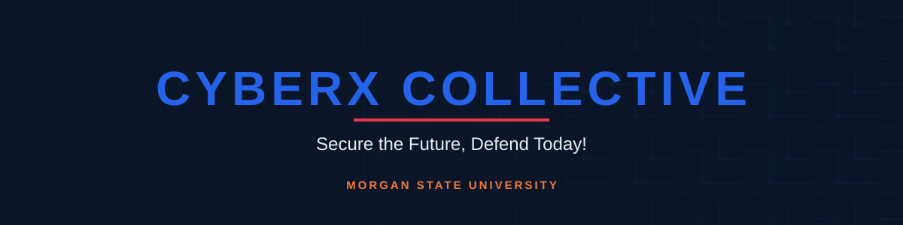

<picture>
  <source media="(prefers-color-scheme: dark)" srcset="assets/banner-dark.svg">
  <source media="(prefers-color-scheme: light)" srcset="assets/banner-light.svg">
  
</picture>

Morgan State University's student-run cybersecurity organization.

<a href="#-who-we-are">Who We Are</a> ·
<a href="#-what-we-do">What We Do</a> ·
<a href="#-join-us">Join Us</a> ·
<a href="#-start-here">Start Here</a>

> [!NOTE]
> This repo is private and internal-only for now. If that changes, nothing here needs rework to go public — see [`CONTRIBUTING.md`](CONTRIBUTING.md) for the contribution process either way.

---

## 🛡️ Who We Are

CyberX Collective is Morgan State's student-run cybersecurity organization, founded in 2025 by Bears who wanted hands-on security experience the classroom doesn't have room for. We're open to any major — you bring curiosity, we bring the lab time.

## ⚡ What We Do

- **CTFs** — team and solo, from beginner-friendly to competitive
- **Workshops** — network defense, OSINT, forensics, cloud security, hands-on tooling
- **Speakers** — practitioners from industry, government, and federal agencies
- **Projects** — member-built tools and write-ups that go straight into a portfolio

> [!NOTE]
> The org was founded in 2025 — we're building our track record now. Show up, and you're part of the first cohort, not a footnote in it.

## 🤝 Join Us

> [!TIP]
> Follow **[@cyberxcollective](https://instagram.com/cyberxcollective)** on Instagram first — that's where meeting times, room numbers, and event announcements post.

<!-- TODO: meeting details -->
Meeting schedule for the semester is being finalized — follow [@cyberxcollective](https://instagram.com/cyberxcollective) on Instagram for announcements. No application, no prerequisites — just show up.

## 🧭 Start Here

| Folder | What's there |
|---|---|
| [start-here/](start-here/README.md) | Your first 30 days: lab setup, then offensive, defensive, GRC, cloud, and appsec learning tracks |
| [opportunities/](opportunities/README.md) | Internships, scholarships, and federal pipelines Morgan State students can apply to right now — tracked as [Issues](https://github.com/VemTech6/cyberx-collective/issues) |
| [career-toolkit/](career-toolkit/README.md) | Résumé templates, portfolio guidance, and interview prep for when an application is due |

> [!IMPORTANT]
> New to the org and don't know where to click first? Start with [start-here/](start-here/README.md) — it's built for exactly that.

---

**Secure the Future, Defend Today!**

Faculty Advisor: Professor Sammie Johnson

[Instagram](https://instagram.com/cyberxcollective)

