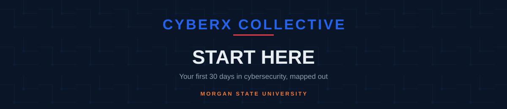

<picture>
  <source media="(prefers-color-scheme: dark)" srcset="../assets/banner-start-here-dark.svg">
  <source media="(prefers-color-scheme: light)" srcset="../assets/banner-start-here-light.svg">
  
</picture>

Zero background required — this is what to install and click first.

<a href="#-lab-setup">Lab Setup</a> ·
<a href="#-learning-tracks">Learning Tracks</a> ·
<a href="#-next-steps">Next Steps</a>

---

This folder is CyberX Collective's first-30-days path: what to install, and which free resources to work through first, whether you've never opened a terminal or you're already comfortable in one. Pick a track once your lab is running — you don't need to finish one before starting another.

## 🧪 Lab Setup

Do this before picking a track — every track assumes you have a working VM.

1. **Install [VirtualBox](https://www.virtualbox.org)** — free, works on Windows/macOS/Linux.
2. **Download a Linux VM.** Ubuntu Desktop if you want a general-purpose environment; Kali Linux if you're heading offensive first. Take a snapshot right after first boot so you can always roll back.
3. **Get comfortable at the command line.** Work through [OverTheWire: Bandit](https://overthewire.org/wargames/bandit/) — a free, beginner-aimed wargame that teaches the Linux basics every other resource here assumes you already have.

> [!TIP]
> Stuck on VM setup or Bandit? That's a normal first-week problem, not a sign you're in the wrong place. Ask in the group chat once it's live, or bring it to a meeting.

## 📚 Learning Tracks

Each track lists 3–5 free resources and one concrete first project. Expand the ones you're interested in.

<strong>Offensive Security</strong>

- [TryHackMe](https://tryhackme.com) — free-tier, browser-based labs; start with the "Pre Security" path
- [HTB Academy](https://academy.hackthebox.com) — free foundational modules on Linux, networking, and intro pentesting
- [PortSwigger Web Security Academy](https://portswigger.net/web-security) — free, the standard for learning web app attacks
- [CyLab Security Academy](https://cylabacademy.org) — free CTF-style challenges, Carnegie Mellon's successor to picoCTF

**First project:** Finish Bandit levels 0–20, then complete TryHackMe's "Pre Security" path end to end.

<strong>Defensive / SOC</strong>

- [LetsDefend](https://letsdefend.io) — free Basic plan, simulated SOC-analyst alert investigations
- [Blue Team Labs Online](https://blueteamlabs.online) — free challenges (built for people with some tool experience — do LetsDefend first)
- [DetectionLab](https://github.com/clong/DetectionLab) — the clearest guide for standing up a monitored Windows AD lab (project is unmaintained since 2023 but still works as a reference)
- [SwiftOnSecurity Sysmon config](https://github.com/SwiftOnSecurity/sysmon-config) — the standard starter Sysmon configuration for Windows logging

**First project:** Set up a Windows AD lab in VirtualBox following the DetectionLab guide, drop in the SwiftOnSecurity Sysmon config, then work your first three alerts on LetsDefend's free plan.

<strong>GRC (Governance, Risk & Compliance)</strong>

- [NIST Cybersecurity Framework 2.0](https://www.nist.gov/cyberframework) — free, the reference framework most GRC work maps back to
- [CIS Critical Security Controls v8.1](https://www.cisecurity.org/controls) — free, a prioritized list of what to secure first
- [ISC2 Certified in Cybersecurity](https://www.isc2.org/Certifications/CC) — entry-level cert with no experience requirement (exam has a cost — check ISC2 for current promotions)

**First project:** Pick one CIS Control (e.g. Control 5: Account Management) and write a one-page policy mapping it to the NIST CSF 2.0 "Protect" function. Put it in a repo — it's a legitimate portfolio piece.

<strong>Cloud Security</strong>

- [AWS Skill Builder — Cloud Practitioner Essentials](https://skillbuilder.aws) — free
- [Microsoft Learn — AZ-900 Azure Fundamentals](https://learn.microsoft.com/en-us/training/paths/microsoft-azure-fundamentals-describe-cloud-concepts/) — free
- [Google Skills (formerly Cloud Skills Boost)](https://www.skills.google) — free monthly credits via the GEAR program

**First project:** Finish AWS Cloud Practitioner Essentials, then create a free-tier S3 bucket with a locked-down IAM policy. Screenshot the policy JSON for your portfolio.

<strong>Application Security</strong>

- [OWASP Top 10](https://owasp.org/www-project-top-ten/) — free, the standard reference for web vulnerability classes
- [OWASP Juice Shop](https://owasp.org/www-project-juice-shop/) — free, intentionally vulnerable app with 116 graded challenges
- [PortSwigger Web Security Academy](https://portswigger.net/web-security) — free (same resource as the offensive track — it belongs in both)

**First project:** Run OWASP Juice Shop locally with Docker and clear every "beginner" difficulty challenge.

## 🧭 Next Steps

> [!IMPORTANT]
> Once you've picked a track and finished a first project, turn it into something you can show. [career-toolkit/](../career-toolkit/README.md) covers how to write it up so it reads well to a recruiter.

Check [opportunities/](../opportunities/README.md) for internships and scholarships you're eligible for right now — several don't require prior experience.

---

**Secure the Future, Defend Today!**

[Instagram](https://instagram.com/cyberxcollective) · [Back to cyberx-collective](../README.md)

